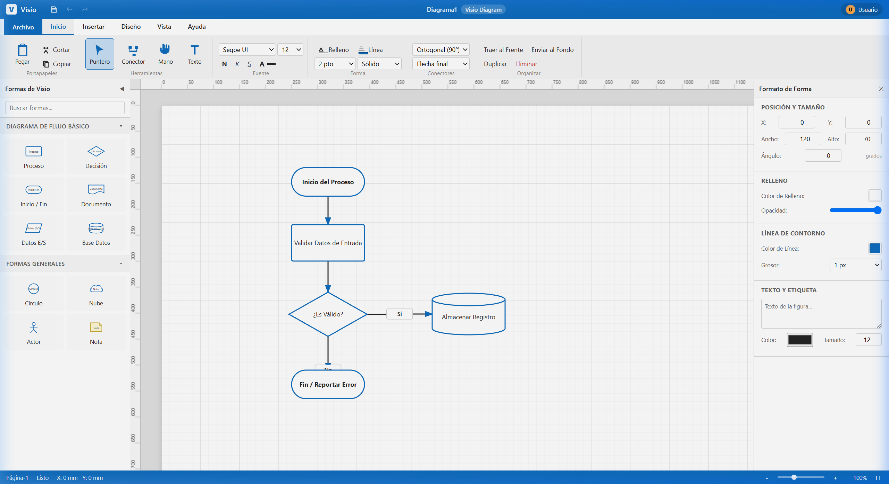
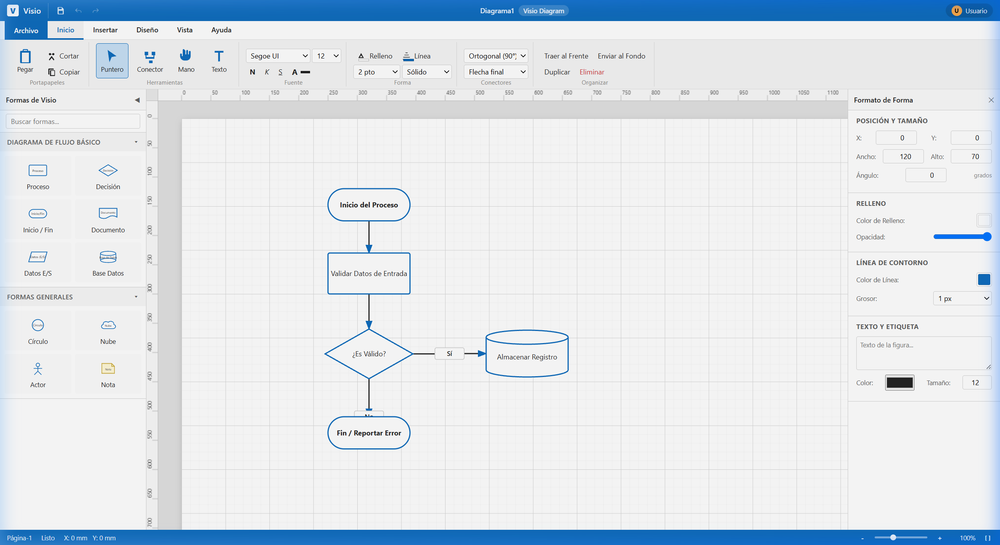
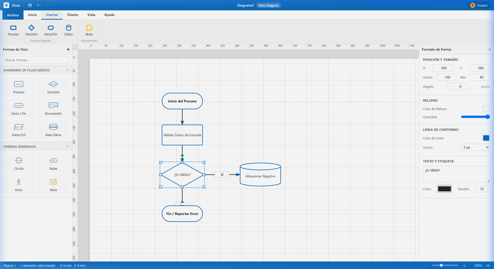
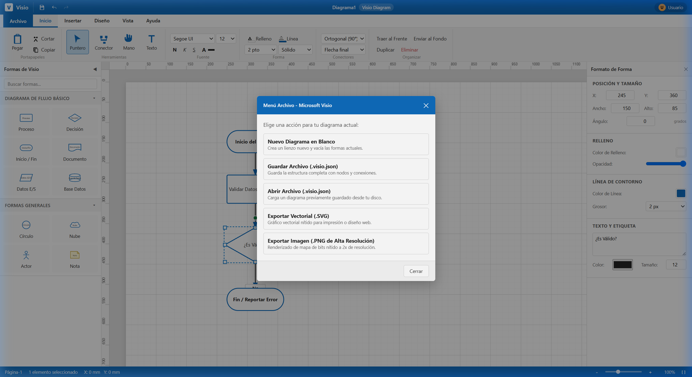

# HtmlVisio — Microsoft Visio Web Clone (Single-File)

[](LICENSE)
[-success.svg)]()
[-orange.svg)]()
[]()

> **HtmlVisio** es un clon ligero, de alta fidelidad y completamente autónomo de **Microsoft Visio**, diseñado en un único archivo ejecutable (`HtmlVisio.html`) con HTML5, CSS3 y JavaScript moderno nativo. No requiere instalación, conexión a internet, NodeJS ni dependencias externas.

---

## 📸 Capturas de Pantalla

### 1. Espacio de Trabajo Principal (Fluent Ribbon & Canvas SVG)
Interfaz idéntica a Microsoft Visio con cinta de opciones Ribbon, paleta de stencils a la izquierda, reglas métricas dinámicas, cuadrícula y diagrama interactivo:



---

### 2. Selección, Transformación con 8 Manijas y Panel de Formato
Marco de selección interactivo con 8 manijas de redimensionamiento ortogonal/diagonal, nodo de rotación angular superior y sincronización bidireccional en el panel derecho:



---

### 3. Pestañas de la Cinta de Opciones (Ribbon de Visio)
Navegación reactiva entre pestañas (*Archivo, Inicio, Insertar, Diseño, Vista, Ayuda*):



---

### 4. Menú Archivo, Plantillas de Ejemplo y Exportación
Guardado y carga en formato nativo `.visio.json`, plantillas precargadas con un clic y exportación a gráfico vectorial `.SVG` o imagen `.PNG` a resolución 2x:



---

## 🚀 Características Principales

- **Un Solo Archivo Autónomo (`HtmlVisio.html`):** Haz doble clic y comienza a diagramar inmediatamente en cualquier navegador web moderno (Edge, Chrome, Firefox, Safari).
- **Cinta de Opciones Ribbon Estilo Office/Visio:**
  - Pestañas organizadas por contexto (*Inicio, Insertar, Diseño, Vista, Ayuda*).
  - Herramientas de dibujo: *Puntero*, *Conector Inteligente*, *Mano/Paneo*, *Texto*.
  - Formato completo de fuentes (Segoe UI, Arial, Calibri, tamaños, colores, negrita, cursiva, subrayado).
  - Formato de formas (Color de relleno, color de contorno, grosores de 1px a 6px, estilos sólido/guiones/puntos).
  - Temas visuales de diagrama (*Azul Visio, Verde Azulado, Púrpura, Naranja*).
- **Lienzo Infinito y Viewport Dinámico:**
  - Paneo fluido con `Barra Espaciadora + Arrastre` o botón central del ratón.
  - Zoom de 25% a 250% mediante rueda del ratón (`Ctrl + Scroll`), deslizador o botones.
  - Reglas métricas horizontales y verticales graduadas y sincronizadas.
  - Cuadrícula milimétrica con soporte magnético (*Snap to Grid*).
- **Biblioteca Vectorial de Stencils:**
  - *Diagrama de flujo:* Proceso, Decisión, Inicio/Fin (Terminal), Documento, Datos (E/S), Base de Datos.
  - *Formas generales y anotaciones:* Círculo, Nube, Actor (UML/Casos de uso), Nota adhesiva.
  - Soporte para **arrastrar y soltar (Drag & Drop)** hacia el lienzo o añadir mediante un clic.
- **Conectores Inteligentes Ortogonales (Algoritmo Manhattan):**
  - Puertos de anclaje magnéticos (Norte, Sur, Este, Oeste).
  - Ruteo ortogonal automático a 90° estilo Visio, o modos de línea recta y curva Bézier.
  - Flechas direccionales nítidas y etiquetas de texto (*Sí*, *No*, etc.).
  - Las conexiones permanecen firmemente unidas y recalculan sus trayectorias al mover las formas.
- **Edición In-situ:**
  - Doble clic en cualquier forma o conector para editar el texto directamente en el lienzo.
- **Historial Completo (Undo / Redo):**
  - Pila inmutable con `Ctrl + Z` y `Ctrl + Y`.
- **Persistencia y Portabilidad:**
  - Guardar y reabrir proyectos en formato abierto `.visio.json`.
  - Exportación vectorial limpia `.SVG`.
  - Exportación a imagen `.PNG` renderizada a 2x de escala para máxima nitidez de impresión.

---

## 📂 Archivos y Plantillas de Prueba Incluidas

El repositorio incluye ejemplos listos para probar en la carpeta [`samples/`](samples/):

1. **[diagrama_flujo_autenticacion.visio.json](samples/diagrama_flujo_autenticacion.visio.json):** Flujo de inicio de sesión con validación de credenciales en base de datos, bifurcación condicional, paso MFA y estados terminales de acceso.
2. **[arquitectura_microservicios_cloud.visio.json](samples/arquitectura_microservicios_cloud.visio.json):** Diagrama de arquitectura con actor cliente, API Gateway, microservicios, bases de datos y nube externa de pagos.
3. **[proceso_aprobacion_compras.visio.json](samples/proceso_aprobacion_compras.visio.json):** Flujo de negocio BPM con órdenes de compra, validación de montos y aprobación gerencial.

> **💡 Consejo:** Puedes cargarlos desde el menú **Archivo > Abrir Archivo (.visio.json)** o hacer clic directamente en los botones de **Plantillas de Ejemplo** dentro del menú Archivo.

---

## ⌨️ Atajos de Teclado

| Atajo | Acción |
| :--- | :--- |
| `V` o `Esc` | Activar herramienta **Puntero** / Cancelar selección |
| `C` | Activar herramienta **Conector Inteligente** |
| `H` o `Espacio` | Activar herramienta **Mano / Paneo** |
| `Ctrl + Z` | **Deshacer** última acción |
| `Ctrl + Y` | **Rehacer** acción |
| `Ctrl + C` / `Ctrl + V` | Copiar y Pegar |
| `Ctrl + D` | **Duplicar** formas seleccionadas |
| `Supr` / `Backspace` | **Eliminar** elementos seleccionados |
| `Ctrl + A` | **Seleccionar todo** |
| `Flechas` | Mover elementos 2px (con `Shift`: 10px) |
| `Doble Clic` | Editar texto de forma o etiqueta |
| `Ctrl + Rueda Ratón` | Zoom interactivo centrado |

---

## 🛠️ Cómo Ejecutarlo

1. Clona el repositorio:
   ```bash
   git clone https://github.com/cdcespon/htmlvisio.git
   ```
2. Abre el archivo:
   - Haz doble clic sobre `HtmlVisio.html` en tu explorador de archivos, o
   - Ábrelo con cualquier navegador web moderno.

---

## 📄 Licencia

Distribuido bajo la Licencia MIT. Consulta el archivo `LICENSE` para más información.
